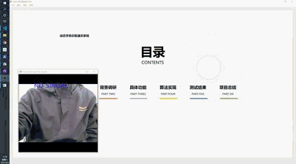
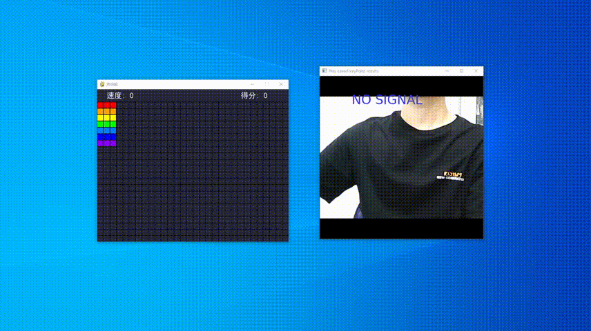
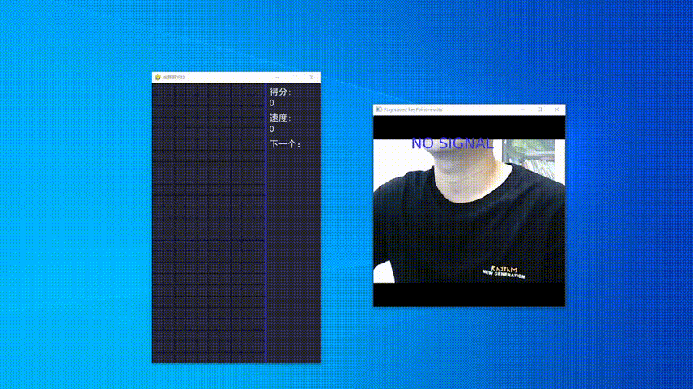

# 动态手势识别及控制系统
This is a pytorch deep learning project that recognizes 9 kinds of dynamic hands and 11 static hands commanding gestures.

识别9种基本动态手势和11种静态手势的Pytorch深度学习项目
包括：
会商演示系统
手部康复系统

<p align="center">
    
</p>

<p align="center">
    
</p>

<p align="center">
    
</p>

<p align="center">
    
</p>

## 安装

### 下载模型参数文件`checkpoint`和生成的骨架`generated`
下载地址：

[百度网盘](https://pan.baidu.com/s/1YOuGTDUlzsr9DypBevch9A )  提取码：06ek

放置在:

```
hgr-pytorch/checkpoints
hgr-pytorch/generated
```


### 下载手势数据集

手势数据集下载：

[百度网盘](https://pan.baidu.com/s/1QyrOQn4GRVV2or5_D5iaYQ )  提取码：eyty

放置在：
```
(用户文件夹)/MeetingHands

# 用户文件夹 在 Windows下是'C:\Users\(用户名)'，在Linux下是 '/home/(用户名)'
```

### 安装Pytorch和其它依赖：
```bash
# Python 3.7.7
conda install pytorch==1.7.1 torchvision==0.8.2 torchaudio==0.7.2 cudatoolkit=10.2 -c pytorch
pip install pyqt5
pip install mediapipe
pip install visdom opencv-python imgaug pillow pywin32
pip install pygame
```

## 使用
```bash
# 使用gui控制系统
python main.py

# 识别自定义视频文件 
python hgr.py -p C:\*.mp4

# 识别摄像头实时视频
python hgr.py -r

# 识别手势数据集中test文件夹第0个视频
python hgr.py -b 0

# 标签生成程序
python getLabel/main.py

# 训练等其它功能见帮助
python hgr.py --help
```

